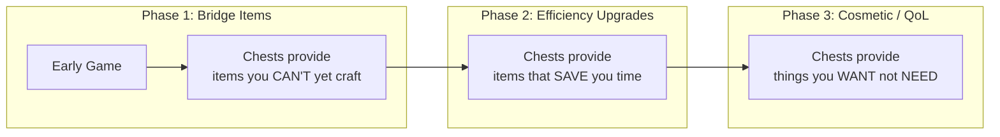
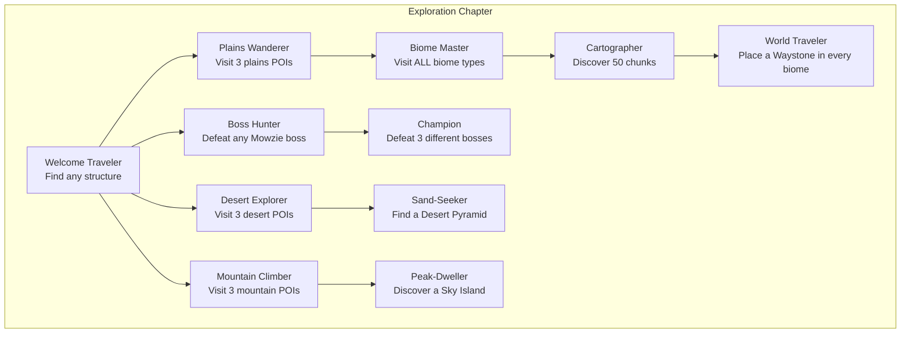
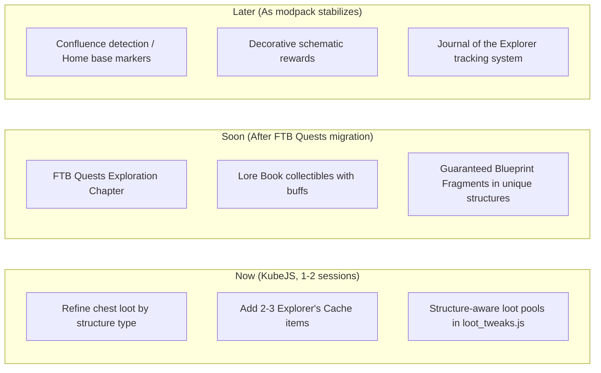

# Exploration Design Plan — Create: Arise

## Design Philosophy

This document captures the refined approach to making exploration compelling in Create: Arise, incorporating the constraints of a solo developer in early stages, the automation-first core loop, and the principle that exploration should be a **cherry on top** — not a better solution than automation.

---

## Core Constraints

| Constraint | Implication |
|---|---|
| **Automation is king** | Once a player has automated X, they should never need to manually gather X again. Exploration rewards must be relevant *before* automation catches up, or provide things automation *cannot* produce. |
| **No RNG progression locks** | Players should never be stuck hoping for a random chest spawn to progress. If something is in a chest, it must be either a bonus or have a deterministic alternative path. |
| **Solo dev, early stages** | Focus on KubeJS-implementable changes first. Avoid core mod development, custom entity AI, or complex structure gen modding. |
| **Retroactive loot irrelevance** | Chest loot that's just "more resources" becomes worthless the moment the player builds a farm. Loot must serve a purpose that doesn't get automated away. |

---

## The Three Phases of Exploration Value

---

## Phase 1: Bridge Items (Highest Priority)

**Problem:** The early game has gated resources (no iron, no diamonds in chests). Players need *something* to bridge the gap between "stone tools" and "I have a create press."

**Solution:** Structure chests currently drop Create components (andesite alloy, cogwheels, casings). This is actually *good* — it gives the player a head start before they automate. **Keep this as-is but make it smarter.**

### What to change:

**1. Don't replace iron/diamonds with random Create stuff — replace them with MEANINGFUL early shortcuts.**

Currently [`chest_loot_tweaks.js`](minecraft/kubejs/server_scripts/chest_loot_tweaks.js) replaces iron ingots with `create:andesite_alloy` everywhere. This is fine broadly, but some specific structures should give *better* early items:

| Structure | Currently | Proposed |
|---|---|---|
| **Abandoned village / Barn** | Same as everything else | **1x Create Hand Crank** — lets the player manually power a press before they have water wheels. Saves them 30 minutes of mining. |
| **Mineshaft** (via YUNG's) | Same as everything else | **1x Create Mechanical Belt + 2x Andestite Casing** — jump-starts early item transport. |
| **Desert Pyramid** | Same as everything else | **1x Create Mechanical Bearing** — enables early windmill power. Saves the player from needing to craft precision mechanisms first. |
| **Igloo** | Same as everything else | **1x Campfire + 1x Create Basin** — allows early bulk smelting / cooking. |
| **Ruined Portal** | Same as everything else | **1x Create Goggles** — lets the player see stress units early. Huge QoL. |

**The key insight:** These are not *resources* — they are **time-savers**. The player can craft all of these eventually. Finding one in a chest just means they got it *earlier* and *for free*. This rewards exploration without making automation irrelevant.

**2. Add 2-3 custom "Explorer's Cache" items via KubeJS**

Create KubeJS items that are *only* found in chests and serve as early-game bridges:

- **`explorers_cog`** — A worn cogwheel that can be used as a cheaper crafting component for the first Create machine. Saves resources early, useless later.
- **`tattered_schematic`** — When right-clicked, teaches the player a specific Create schematic (e.g., a basic cobble gen design). Purely informational, not a required item.

---

## Phase 2: Efficiency Upgrades (Medium Priority)

**Problem:** Mid-game, once automation is running, standard chest loot (ingots, components) is worthless. The player has farms for everything.

**Solution:** Mid-game structures should contain items that **cannot be automated** or that **provide convenience**.

### What to change:

**1. Keep the Artifacts pool** — This is already good. Artifacts are non-automatable, provide permanent QoL, and are exciting to find. The current 15% chance in all chests is fine.

**2. Add Waystone activation scrolls** — A custom KubeJS item found in *dungeon* chests (strongholds, fortresses, pyramids) that, when used, permanently links two waystones together. This rewards exploration of *dangerous* structures specifically.

**3. Add "Blueprint Fragments" — BUT as guaranteed structure loot, not RNG**

Your concern about RNG frustration is 100% valid. Here's the refined model:

- Each **specific unique structure** (e.g., the Terralith Mage Tower, the Mowzie's Frostmaw arena, the YUNG's Fortress throne room) has a chest containing **one specific Blueprint Fragment**, 100% guaranteed.
- These fragments are **not progression-locking**. They unlock *alternative recipes* for items the player could eventually make anyway, but with different materials or in a different order.
- Example: A fragment found in the Frostmaw arena lets the player craft a Create Freezer using ice + brass instead of requiring nether quartz. It's a *sidegrade*, not a gate.

**4. "Lore Books" as collectibles**

A set of 5-7 written books scattered in major structures across the world. Each contains a short story about the world's history, a hint about a biome or structure the player hasn't visited yet, and a *small permanent buff* when collected (e.g., +1 max health via KubeJS effects). This gives completionist players a reason to visit every biome.

---

## Phase 3: Cosmetic / QoL (Low Priority, Future Scope)

**1. Decorative blueprint unlocks** — Rare schematics for aesthetically-pleasing Create builds (fountains, decorative windmills, specific building styles). Only found in chests. No gameplay impact, but builders love them.

**2. "Journal of the Explorer"** — A custom KubeJS item that tracks which biomes/structures the player has discovered. Popup when entering a new biome for the first time ("You discovered the Enchanted Tangle!"). Purely dopamine.

**3. Biome-specific decorative blocks** — Some structures could have small quantities of decorative blocks (Chipped variants, unique stone types) not craftable. If the player wants a particular color for their base, they need to find it.

---

## The "Home Base Instinct" — Lightweight Implementation

Rather than complex structure placement, here's a lightweight approach using KubeJS + existing mods:

### 1. Confluence Markers on the Map

Xaero's Minimap already supports waypoint sharing. Add a KubeJS script that, when the player enters a new biome, checks if they're near the boundary of 2+ biomes. If so, log a toast: *"You stand at the meeting of three lands. This could be a good place to settle."*

**Implementation:** Use KubeJS `PlayerEvents.tick()` (with a cooldown, not every tick) to check biome at player position and adjacent chunks. On first detection of a multi-biome area, fire a toast.

### 2. Surface Loot Markers

Same mechanic as the "no-build band" in [`ARCHITECTURE.md`](ARCHITECTURE.md) — but inverted. Mark certain terrain formations (tectonic-generated tall peaks, island clusters, valley confluences) with a particle effect visible from a distance, drawing the player toward them.

### 3. Rare Structure: "The Surveyor's Post"

A small MVS/MBS structure that always spawns at a multi-biome confluence. Contains a chest with:
- A Nature's Compass (if player doesn't have one)
- A written book listing nearby biomes
- A small food/item reward

This makes the *location itself* the reward — the player finds a strategically valuable spot and gets confirmation it's valuable.

---

## FTB Quests Integration (Future Migration)

When migrating from Questlog to FTB Quests, design an **Exploration Chapter** with these principles:

### Quest Design Rules

| Rule | Reason |
|---|---|
| Every quest rewards something **useable but non-essential** | Never lock core progression behind exploration RNG |
| Discovery quests reward XP / small items | The reward isn't the point — the *checkmark* is |
| Multi-biome quests require visiting 3+ of a type | Encourages breadth without demanding specific RNG |
| Boss kill quests reward unique crafting materials | Gives purpose to Mowzie's mobs and other bosses |

### Proposed Quest Tree

### Rewards Structure

| Quest | Reward |
|---|---|
| Welcome Traveler | Compass + Map |
| Plains Wanderer | 1x Hand Crank + Bread |
| Desert Explorer | 1x Empty Blaze Burner + Torches |
| Mountain Climber | 1x Mechanical Belt + Rope |
| Biome Master | Artifact (random) |
| Cartographer | Waystone |
| Boss Hunter | Boss-specific crafting material (used in unique recipe) |
| World Traveler | Global Waystone unlock |

---

## Implementation Priority Matrix

---

## Summary of Changes to Existing Files

| File | Change |
|---|---|
| [`chest_loot_tweaks.js`](minecraft/kubejs/server_scripts/chest_loot_tweaks.js) | Replace blanket replacements with structure-aware pools. Add per-structure unique items (Hand Crank for barns, Belt for mineshafts, Bearing for pyramids, etc.) |
| [`startup_scripts/main.js`](minecraft/kubejs/startup_scripts/main.js) | Register 2-3 new custom items: `explorers_cog`, `tattered_schematic` (informational), `lore_page` (collectible) |
| [`structure_spawns.js`](minecraft/kubejs/server_scripts/structure_spawns.js) | No changes needed — the structure-biome mapping is already good |
| [`ARCHITECTURE.md`](ARCHITECTURE.md) | Add a section on exploration design philosophy (this document's key points) |
| New: `plans/exploration-design-plan.md` | This document |

---

## Design Principles to Remember

1. **Exploration enhances automation, it doesn't replace it.** Finding a Hand Crank saves you time. Finding 100 iron ingots would make your iron farm pointless. Always prefer time-savers over resource-dumps.

2. **Guaranteed > Random.** If something is in a chest, either make it 100% spawn (like the proposed Blueprint Fragment for specific structures) or make it a nice bonus (like Artifacts at 15%). Never put a progression-critical item at 5% in a pool of 50.

3. **Early game matters most.** Once a player has a working Create setup, chest loot is mostly irrelevant. Focus exploration rewards on the first 2-3 hours of gameplay, because that's when the player is *already* exploring by necessity.

4. **The "cherry on top" test.** Before adding any exploration reward, ask: "If the player automated this, would this still feel good?" If yes (artifacts, blueprints, lore, cosmetics), it passes. If no (raw resources), reconsider.
